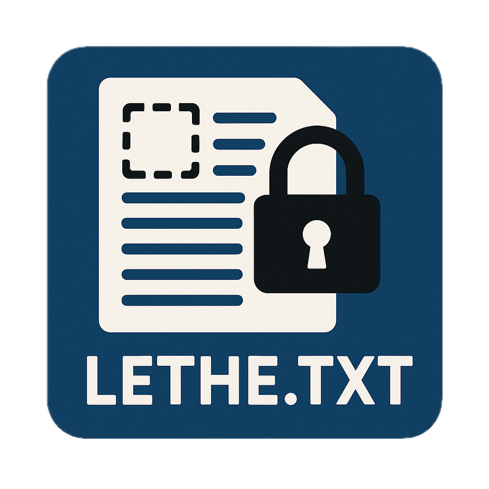

<p align="center">
  
</p>

# 🔒 Lethe.TXT

**Anonimizador de Documentos** - Proteja dados sensíveis em seus arquivos de forma simples e reversível.

O Lethe.TXT detecta e substitui automaticamente:
- 👤 **Nomes de pessoas** (usando NLP com spaCy)
- 📋 **CPFs** (com validação de dígitos verificadores)
- 🪪 **RGs** (com validação de formato)
- 📅 **Datas de nascimento** (substituídas por datas que garantem 18+ anos)

## 📋 Requisitos

- Python 3.12+
- [UV](https://github.com/astral-sh/uv) (gerenciador de pacotes recomendado)

### Dependências do Sistema (para arquivos .doc)

Para processar arquivos `.doc` antigos, você pode precisar instalar:

**macOS:**
```bash
brew install antiword
```

**Ubuntu/Debian:**
```bash
sudo apt-get install antiword
```

## 🚀 Instalação

### 1. Clone ou baixe o projeto

```bash
cd LetheTXT
```

### 2. Crie o ambiente virtual

```bash
uv venv .venv
```

### 3. Ative o ambiente virtual

**macOS/Linux:**
```bash
source .venv/bin/activate
```

**Windows:**
```cmd
.venv\Scripts\activate.bat
```

### 4. Instale as dependências

```bash
uv pip install -r requirements.txt
```

## 💻 Uso

### Interface Web (Streamlit)

A forma mais simples de usar o Lethe.TXT:

**macOS/Linux:**
```bash
./run_streamlit.sh
```

**Windows:**
```cmd
run_streamlit.bat
```

Ou manualmente:
```bash
source .venv/bin/activate  # ou .venv\Scripts\activate.bat no Windows
streamlit run app.py
```

A interface será aberta automaticamente no navegador em `http://localhost:8501`.

### Interface CLI (Linha de Comando)

Para automação ou uso em scripts:

#### Anonimizar um documento

```bash
python cli.py anonymize documento.docx -p "minha_senha_secreta"
```

Opções:
- `-o, --output`: Arquivo de saída (padrão: `<nome>_anonimizado.txt`)
- `-m, --mapping`: Arquivo de mapeamento (padrão: `<nome>_mapping.lethe`)
- `-s, --seed`: Seed para resultados reproduzíveis
- `--show-mapping`: Exibir substituições realizadas

#### Reverter anonimização

```bash
python cli.py reverse documento_anonimizado.txt documento_mapping.lethe -p "minha_senha_secreta"
```

Opções:
- `-o, --output`: Arquivo de saída (padrão: `<nome>_restaurado.txt`)

#### Ver informações

```bash
python cli.py info
```

## 📁 Formatos Suportados

| Formato | Extensão | Biblioteca |
|---------|----------|------------|
| Texto simples | `.txt` | Nativo |
| Word (novo) | `.docx` | python-docx |
| Word (antigo) | `.doc` | textract (requer antiword) |
| PDF | `.pdf` | pypdf |

## 🔐 Segurança

O mapeamento de substituições (que permite reverter a anonimização) é criptografado usando:

- **Algoritmo**: Fernet (AES-128-CBC + HMAC)
- **Derivação de chave**: PBKDF2 com SHA-256 (480.000 iterações)
- **Salt**: 16 bytes aleatórios por arquivo

⚠️ **Importante**: Guarde a senha e o arquivo `.lethe` em local seguro. Sem eles, não é possível reverter a anonimização.

## 📊 Exemplo de Uso

### Texto Original
```
João da Silva, CPF 123.456.789-09, nascido em 15/03/1990, 
compareceu à audiência representado por Maria Santos.
```

### Texto Anonimizado
```
Pedro Oliveira, CPF 987.654.321-00, nascido em 22/07/1985, 
compareceu à audiência representado por Ana Costa.
```

## 🛠️ Estrutura do Projeto

```
LetheTXT/
├── app.py                 # Interface Streamlit
├── cli.py                 # Interface CLI (Typer)
├── core/
│   ├── __init__.py
│   ├── anonymizer.py      # Lógica de anonimização
│   ├── crypto.py          # Criptografia do mapeamento
│   ├── document_parser.py # Extração de texto
│   ├── entity_detector.py # Detecção de entidades (spaCy)
│   └── validators.py      # Validação de CPF/RG
├── benchmark_parsers.py   # Benchmark de bibliotecas
├── requirements.txt
├── run_streamlit.sh       # Script de execução (Unix)
├── run_streamlit.bat      # Script de execução (Windows)
└── README.md
```

## 🧪 Executar Benchmark

Para testar a performance das bibliotecas de parsing:

```bash
python benchmark_parsers.py
```

## 📝 Notas

- O modelo spaCy `pt_core_news_lg` é baixado automaticamente com as dependências
- Para arquivos muito grandes, considere usar a CLI para melhor performance
- A detecção de nomes depende do contexto - nomes isolados podem não ser detectados

## 👤 Autor

**Matheus C. Pestana** / GENI-UFF

## 📄 Licença

Este projeto é de código aberto. Use com responsabilidade.

